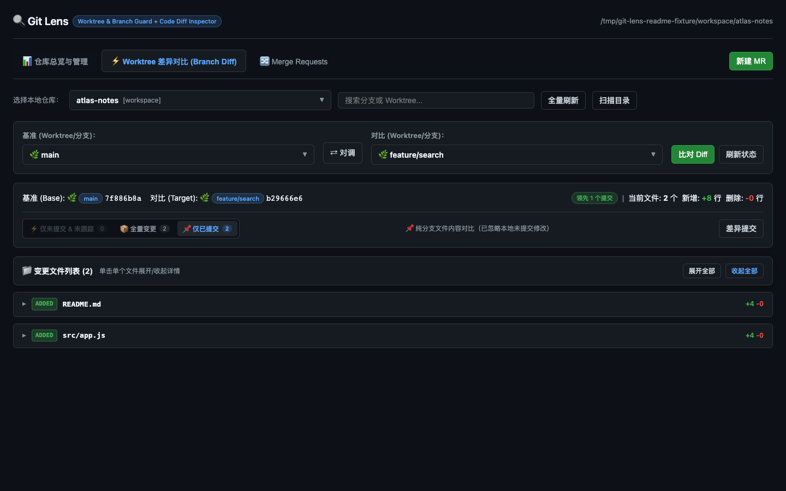
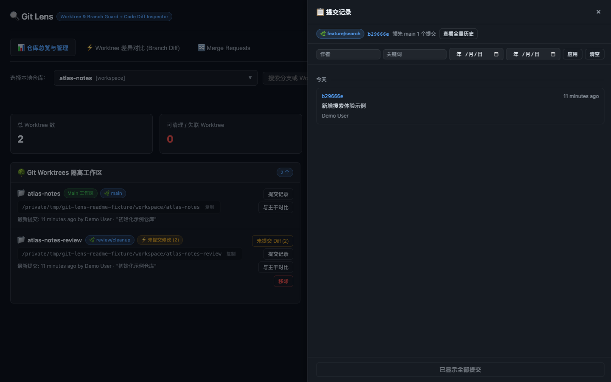
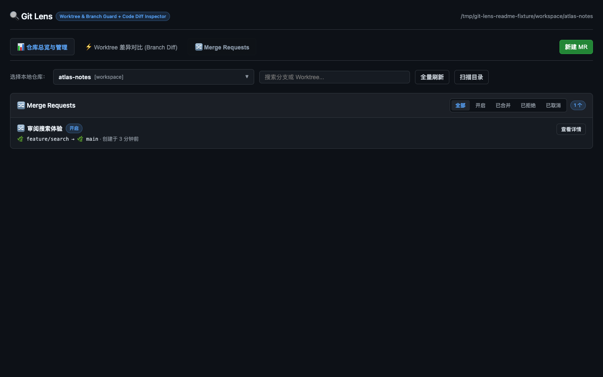
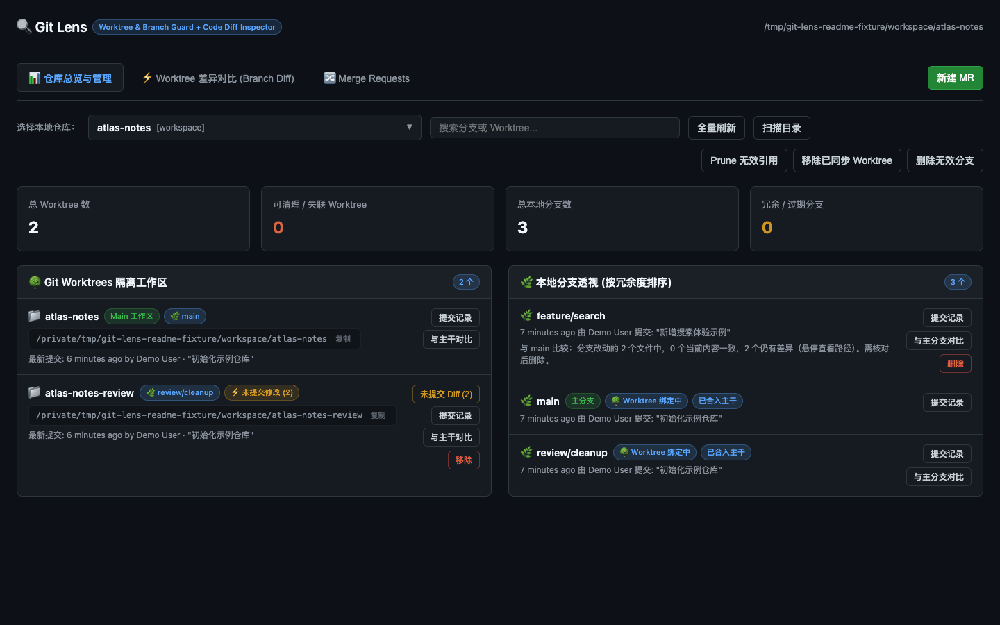

# 🔍 Git Lens Web

**看清本地 Git 仓库的 Worktree、分支和代码差异。**

Git Lens Web 是一个运行在浏览器里的本地 Git 工作台：扫描你指定的 Workspace，集中查看仓库状态、Worktree、分支、提交和 Diff，再决定是否清理或执行本地 Git 操作。

[快速开始](#快速开始) · [功能概览](#功能概览) · [界面预览](#界面预览) · [使用指南](#使用指南) · [配置与数据](#配置与数据) · [项目结构](#项目结构)

> [!NOTE]
> 文档中的界面图片和动图由当前版本在临时虚构仓库中实际运行生成。图片里的仓库名、路径、提交、分支和用户均为演示数据，不对应任何真实项目。

## 为什么使用它

多个分支和 Worktree 并行开发时，状态通常分散在不同目录和命令行窗口里：

- 不容易快速判断哪个 Worktree 还有未提交改动；
- 分支已经被合并、被 Cherry-pick 吸收或只剩无效引用时，单看提交数量容易误判；
- 对比两个分支前，常常需要先创建 Worktree；
- 清理 Worktree、分支或未提交修改时，需要在多个 Git 命令之间切换。

Git Lens Web 把这些信息放进一个本地页面，先展示事实和 Diff，再提供有确认步骤的清理、Stash、Cherry-pick、Revert 和本地 MR 操作。

## 功能概览

| 模块 | 当前能力 |
| --- | --- |
| 📁 扫描目录 | 添加多个 Workspace 并持久化；检查目录本身和直接子目录中的 Git 仓库；支持系统目录选择器和手动输入路径。 |
| 📊 仓库总览 | 展示 Worktree、分支、失联引用和可清理项；支持仓库搜索、收藏和星标筛选。 |
| 🌳 Worktree 管理 | 区分主工作区和派生 Worktree，显示目录状态、未提交文件、领先提交和绑定分支；支持移除 Worktree、Prune 无效引用和批量清理。 |
| 🌿 分支透视 | 展示主分支、Worktree 占用、已合入、内容已被吸收和过期分支；支持普通删除或强制删除。 |
| ⚡ Branch Diff | Base 和 Target 可分别选择 Worktree 或本地分支，支持 Worktree ↔ Worktree、分支 ↔ 分支以及混合比较。 |
| 🧹 未提交自审 | 选择同一个 Worktree 时进入自审模式，查看未提交和未跟踪文件；支持 Stash、Pop、Drop 和丢弃全部修改。 |
| 🔀 本地 MR | 对两个本地分支创建 Merge Request，经过通过、要求修改或拒绝后再执行 `git merge --no-ff`；冲突会自动中止并保留 MR。 |
| 📋 提交记录 | 查看分支相对主干的领先/落后，按作者、关键词和日期过滤，按日期分组浏览，并展开提交详情和单提交 Diff。 |
| 🍒 提交操作 | 对当前分支执行 Cherry-pick 或 Revert；冲突、空提交和不合法目标会返回中文错误，并自动恢复现场。 |
| 🏷️ 浏览器标签识别 | 标签标题包含当前仓库和功能页；同名仓库会补充上级目录；favicon 使用项目首字母和稳定颜色区分多个浏览器标签。 |

## 界面预览

### 仓库总览

总览页把 Worktree 和本地分支放在一起，先看清 Dirty、主分支、Worktree 绑定和可清理状态，再进入 Diff 或提交记录。


### Branch Diff

Base 和 Target 可以分别选择 Worktree 或本地分支。分支 ↔ 分支比较只读取引用内容，不受任意 Worktree 的未提交改动影响。



### 提交记录抽屉

提交抽屉支持过滤、日期分组、详情展开和单提交 Diff，适合在执行 Cherry-pick 或 Revert 前确认提交内容。



### 本地 MR

本地 MR 面板记录源分支、目标分支、审阅状态和合并状态；合并前会检查目标 Worktree 是否干净。



### 一段动图看完整流程

下面的动图来自同一组虚构 fixture，依次展示仓库总览、Branch Diff、未提交自审和本地 MR。它不是设计稿，而是当前页面的实际渲染结果。



## 快速开始

### 环境要求

- 已安装 Git，并且 `git` 可以在终端直接调用；
- 已安装 npm；
- Node.js 版本满足 `^20.19.0 || >=22.12.0`；
- 当前机器可以访问本机浏览器。

### 启动服务

```bash
git clone YOUR_REPOSITORY_URL
cd git-lens-web
npm ci
npm start
```

启动后打开 [http://127.0.0.1:9527](http://127.0.0.1:9527)。

如果端口已占用，可以换一个端口：

```bash
PORT=8080 npm start
```

Windows PowerShell：

```powershell
$env:PORT=8080
npm start
```

服务只监听本机 `127.0.0.1`。不要直接双击打开 `public/index.html`，页面需要通过本地服务访问 Git API 和系统目录选择器。

### 隔离开发或测试实例

测试实例必须使用独立端口和独立配置目录，避免覆盖日常使用的配置：

```bash
PORT=9528 \\
GIT_LENS_CONFIG_DIR=/tmp/git-lens-web-dev-9528 \\
node src/server.js
```

浏览器打开 [http://127.0.0.1:9528](http://127.0.0.1:9528)。

## 使用指南

### 1. 配置扫描目录

首次打开页面时，点击「扫描目录」，使用系统目录选择器或手动输入添加一个或多个 Workspace。

每个扫描目录按以下规则处理：

1. 如果目录本身是 Git 仓库，直接加入仓库列表；
2. 如果目录本身不是 Git 仓库，只检查它的直接子目录；
3. 不会递归扫描更深层级；
4. 不存在、不可读或不是目录的路径会被拒绝保存。

### 2. 选择仓库

顶部仓库选择器支持：

- 按仓库名或路径模糊搜索；
- 将常用仓库加入星标；
- 只看星标仓库；
- 使用方向键和 Enter 选择；
- 在 URL 和当前浏览器标签页中恢复仓库、功能页和 Diff 状态。

### 3. 查看仓库状态

在「仓库总览与管理」中重点关注：

- Worktree 是否存在于磁盘；
- Worktree 是否有未提交或未跟踪文件；
- 分支是否被 Worktree 占用；
- 分支是否已经合入、被内容吸收或长期未活动；
- 是否存在失联 Worktree 引用和可安全清理项。

领先徽章会结合祖先关系、树一致、补丁等价和 `merge-tree` 判定，避免把已经通过 Cherry-pick、Revert 或 squash 吸收的内容继续当成独有改动。

### 4. 审查 Diff

可以从 Worktree 或分支行进入 Diff，也可以直接打开「Worktree 差异对比 (Branch Diff)」：

- **仅未提交 & 未跟踪**：只看工作区当前修改；
- **全量变更**：同时看提交内容和未提交修改；
- **仅已提交**：只比较引用中的已提交内容；
- **同一 Worktree**：自动进入未提交自审模式；
- **分支 ↔ 分支**：不读取任何 Worktree 的脏数据；
- **图片和二进制文件**：按文件类型展示，不把二进制内容当作普通文本 Diff。

### 5. 使用本地 MR

创建本地 MR 后按以下流程操作：

1. 选择源分支和目标分支；
2. 填写标题和描述；
3. 审阅通过、要求修改或拒绝；
4. 只有审阅通过后才能合并；
5. 合并使用 `git merge --no-ff`，成功后记录合并提交；
6. 目标 Worktree 不干净或发生冲突时，服务会自动中止合并并保留 MR。

### 6. 管理提交和未提交修改

从 Worktree 或分支行打开「提交记录」：

- 按作者、关键词、开始日期和结束日期过滤；
- 按日期分组查看提交；
- 展开完整提交正文、父提交和文件统计；
- 查看单提交逐文件 Diff；
- 将提交 Cherry-pick 到指定目标 Worktree；
- Revert 当前分支上的提交；
- 对未提交修改执行 Stash、Pop、Drop 或丢弃全部修改。

所有会修改 Git 仓库的操作都有二次确认。操作失败时会返回明确错误；Cherry-pick、Revert 和 MR 合并会尽量自动中止，避免仓库残留冲突状态。

### 7. 清理 Worktree 和分支

确认 Diff 和提交内容后，再执行清理：

- 「Prune 无效引用」对应 `git worktree prune`；
- Worktree「移除」对应 `git worktree remove`；
- 可选择同步删除仍与 Worktree 强绑定的分支；
- 分支删除前会再次校验绑定关系和当前状态；
- 批量清理只处理符合安全条件的候选项。

> [!CAUTION]
> 清理、Stash、丢弃修改、Cherry-pick、Revert 和本地 MR 合并都会修改本地 Git 仓库。执行前请核对目标路径、分支和需要保留的提交。未合并分支的删除可能使用强制删除。

## 配置与数据

默认配置文件：

```text
~/.config/git-lens-web/config.json
```

可以用环境变量覆盖配置目录：

```bash
GIT_LENS_CONFIG_DIR=/tmp/git-lens-web-dev-9528
```

配置文件只保存扫描目录列表。仓库状态、提交、分支和 Diff 都在请求时直接从本地 Git 仓库读取。

本地 MR 的记录也保存于配置目录下，按仓库路径归一化后分开存储。应用不会把仓库内容上传到远程服务。

## 浏览器标签识别

每个浏览器标签会根据当前状态更新：

- 标题格式：`仓库名 · 功能页 | Git Lens`；
- 同名仓库标题补充扫描分组，例如 `workspace/atlas-notes`；
- favicon 使用项目首字母、稳定颜色和放大镜标记；
- 切换仓库、切换 Overview/Diff/MR、刷新或通过 URL 恢复时都会同步更新。

因此同时打开多个项目时，可以通过标签文字和颜色快速定位，而不必逐个点开确认。

## 项目结构

```text
public/index.html       浏览器界面、样式与交互
src/server.js           本地 HTTP 服务、仓库发现与 API 路由
src/git-inspector.js    Git 状态分析、Diff、提交和清理操作
src/merge-request-service.js
                        本地 MR 状态机和 Git 合并流程
src/merge-request-store.js
                        本地 MR 持久化
scripts/                fixture 构建与 HTTP 验证脚本
test/                   Git 状态、Diff、MR、Stash 和清理测试
docs/images/            README 和设计文档配图
```

当前前端使用原生 HTML、CSS 和 JavaScript，服务通过 `npm start` 直接运行，无需先生成前端构建产物。Node 服务通过 Git CLI 读取和修改本地仓库。

## 验证

运行仓库测试：

```bash
node --test
```

集成验证脚本需要先启动隔离服务，并将测试配置目录指向同一份 `GIT_LENS_CONFIG_DIR`。具体命令和 fixture 构建方式见：

- [本地 MR 与 Branch Diff 验证说明](./docs/local-mr-branch-diff.md)
- [Worktree 提交记录入口方案](./docs/proposals/worktree-commits-entry.md)

## 许可证

本项目使用仓库中的 [LICENSE](./LICENSE)。
