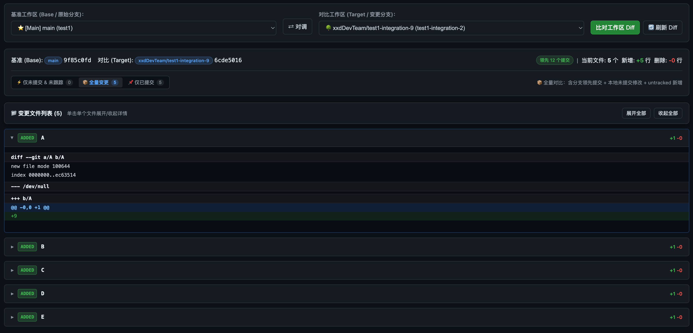

# 🔍 Git Lens Web

**看清本地仓库的 Worktree、分支与代码差异。**

一个在浏览器中运行的本地 Git 工作台：发现闲置工作区，审查变更，再决定是否清理。

[快速开始](#快速开始) · [功能概览](#功能概览) · [界面预览](#界面预览) · [使用指南](#使用指南) · [仓库发现范围](#仓库发现范围)

---

## 为什么使用它

多个分支和 Worktree 并行开发时，容易忘记哪些目录还有未提交改动、哪些分支已合并、哪些 Worktree 只剩 Git 元数据。Git Lens Web 将这些信息集中展示，并提供提交记录和 Diff 视图，帮助你在清理前先确认状态。

## 功能概览

| 模块 | 你可以做什么 |
| --- | --- |
| 📁 扫描目录 | 使用系统文件夹选择器添加多个 Workspace 并持久化；首次打开时引导设置，按目录本身或直接子目录发现 Git 仓库。 |
| 📊 仓库总览 | 查看 Worktree 与本地分支数量、失联工作区和冗余分支提示；搜索仓库、分支和 Worktree，并收藏常用仓库。 |
| 🌳 Worktree 管理 | 区分主工作区与派生 Worktree，查看目录是否存在、未提交文件数及领先提交数；清理无效引用或移除指定 Worktree。 |
| 🌿 分支透视 | 识别主分支、被 Worktree 占用的分支、已合并分支，以及超过 30 天未活动的分支；按情况执行普通或强制删除。 |
| ⚡ 代码审查 | 对比两个 Worktree 的已提交、未提交或全量变更；选择同一个 Worktree 时审查本地未提交与未跟踪文件，并支持图片前后对比。 |
| ↔️ Branch Diff | 对比源与目标可自由切换为 Worktree 或分支，任意组合两两对比（含分支 ↔ 分支的纯引用比较），不必先为分支建 Worktree；支持仅未提交 / 全量 / 仅已提交三种模式。 |
| 🔀 本地 MR | 对同一仓库的两个本地分支发起合并请求，走「审阅（通过 / 要求修改 / 拒绝）→ 合并（或取消）」流程；合并使用 `--no-ff` 实际更新目标分支，冲突时自动中止并保持 MR 打开。 |
| 📋 提交记录 | 从 Worktree 条目打开提交记录抽屉：一眼看到相对主干的领先/落后，逐页加载提交列表，支持按作者、日期范围与关键词过滤，另有按日期分组的时间线视图和图形化分支历史。 |
| 🍒 提交洞察与操作 | 点击提交展开详情（完整正文、父提交、文件级增删统计）并查看单提交逐文件 Diff；可对当前分支执行 Cherry-pick / Revert，失败时自动恢复仓库现场。 |

## 界面预览

从仓库总览开始，先快速确认 Worktree、分支和可清理引用的整体状态，再进入差异视图检查具体变更。

### 仓库总览与管理

仓库总览集中展示 Worktree、分支和失效引用，并提供搜索、刷新、Prune 和逐项清理入口。


### Worktree 差异对比

选择 Base 和 Target Worktree 后，可以按文件展开 Diff，查看新增、删除及提交领先情况。



## 快速开始

**环境要求：**已安装 Git、npm，以及符合 `^20.19.0 || >=22.12.0` 的 Node.js（与仓库锁定依赖的版本要求一致）。

```bash
git clone YOUR_REPOSITORY_URL
cd git-lens-web
npm ci
npm start
```

将 `YOUR_REPOSITORY_URL` 换成 GitHub 页面「Code」菜单中的克隆地址。启动后打开 [http://127.0.0.1:9527](http://127.0.0.1:9527)。

如果 `9527` 已被占用，可指定端口：

```bash
PORT=8080 npm start
```

在 Windows PowerShell 中可使用 `$env:PORT=8080; npm start`。

服务只监听本机 `127.0.0.1`。从主目录或任意 Worktree 启动均可；**启动位置不影响仓库扫描范围**。

## 使用指南

1. **配置扫描目录**：首次打开时按引导使用系统文件夹选择器添加一个或多个 Workspace，也可以随时点击顶部的「📁 扫描目录」修改。Git Lens 会检查目录本身以及其中的直接子目录，找到可用的 Git 仓库。
2. **选择仓库**：在顶部下拉框中搜索仓库名或路径；当前项目会置顶，常用仓库可加入星标并用「只看星标」筛选。
3. **检查状态**：在「仓库总览与管理」查看 Worktree 的 Dirty、失联和领先提交状态，以及分支的合并与占用情况。
4. **审查变更**：点击 Worktree 的「未提交 Diff」「提交记录」或「与主干对比」，也可进入「Worktree 差异对比」自行选择 Base 和 Target。Diff 支持「仅未提交」「全量变更」「仅已提交」三种模式；Base 与 Target 相同时进入本地自审模式。对比源与目标也可以切换为分支：分支 ↔ 分支为纯引用比较，不受任何工作区未提交内容影响。
5. **发起本地 MR**：对同一仓库的两个本地分支创建合并请求，先审阅（通过 / 要求修改 / 拒绝），通过后执行合并。合并会以 `--no-ff` 实际更新目标分支并生成合并提交；存在冲突或目标 Worktree 不干净时合并会被拒绝，MR 保持打开。
6. **按需清理**：确认内容后，再使用「一键 Prune 无效引用」、Worktree「移除」或分支「删除」。移除 Worktree 时可以选择是否同步删除与它绑定的分支，默认保留分支。

> [!CAUTION]
> 清理操作会修改本地 Git 仓库。Worktree「移除」使用 `git worktree remove --force`；未合并分支的「删除」使用 `git branch -D`。提交抽屉内的 Cherry-pick / Revert 同样会修改当前分支，操作前有二次确认；执行失败（含冲突）时服务端会自动中止并恢复仓库原状。**合并 MR 会实际修改目标分支的 Worktree**（`git merge --no-ff`），合并前请确认目标 Worktree 干净且无未推送的依赖。操作前请核对目标路径、未提交改动和需要保留的提交。`Prune` 对应 `git worktree prune`，清理的是失效的 Worktree 元数据引用。

## 仓库发现范围

当前版本不再假设任何固定的目录结构。首次打开页面时需要添加一个或多个自定义扫描目录，也可以通过顶部的「📁 扫描目录」按钮随时调整。目录可以使用系统文件夹选择器添加，也可以手动输入路径。

每个扫描目录会按以下规则处理：

- 如果目录本身是 Git 仓库，直接将它加入仓库列表。
- 如果目录本身不是 Git 仓库，只检查其中的直接子目录，不递归深入更深层级。
- 目录配置保存在当前用户主目录下的 `~/.config/git-lens-web/config.json`，不会写入项目仓库。

「选择文件夹」会调用运行服务所在电脑的系统目录选择器：macOS 使用 `osascript`，Windows 使用 PowerShell，Linux 优先使用 `zenity`，也支持回退到 `kdialog`。如果 Linux 环境没有图形目录选择器，可以展开手动输入区域填写路径。

如果页面没有显示仓库，请检查目录路径是否存在、当前用户是否有读取权限，以及仓库是否位于扫描目录的直接子目录中。

## 项目结构

```text
public/index.html       浏览器界面与交互
src/server.js           本地 HTTP 服务、仓库发现与 API
src/git-inspector.js    Git 状态分析、Diff 与清理操作
scripts/                验证脚本（fixture 仓库构建与本地 MR/Branch Diff 集成断言）
```

前端使用原生 HTML、CSS 和 JavaScript，服务通过 `npm start` 启动，无需额外构建步骤。
